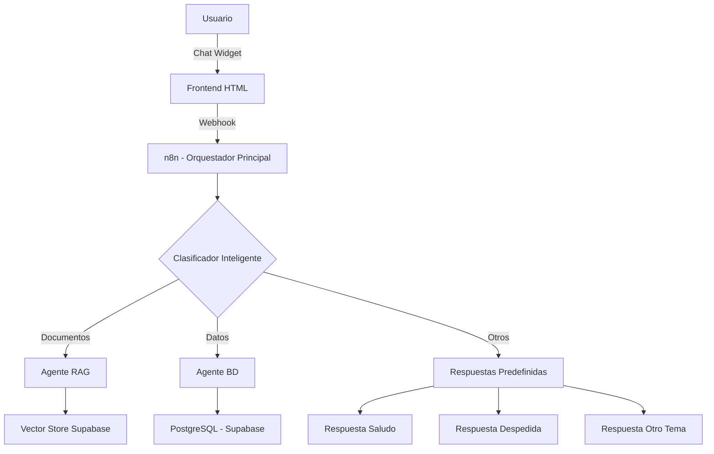
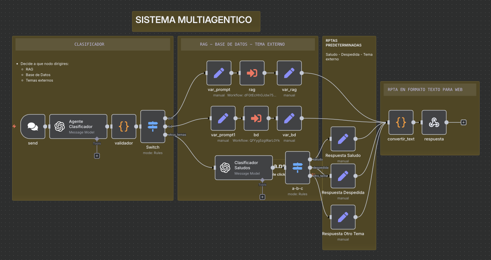
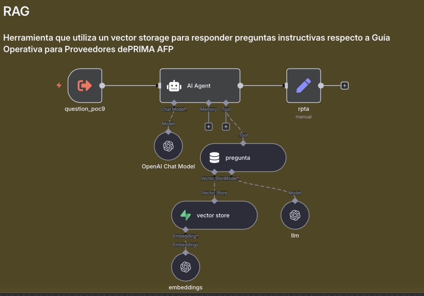
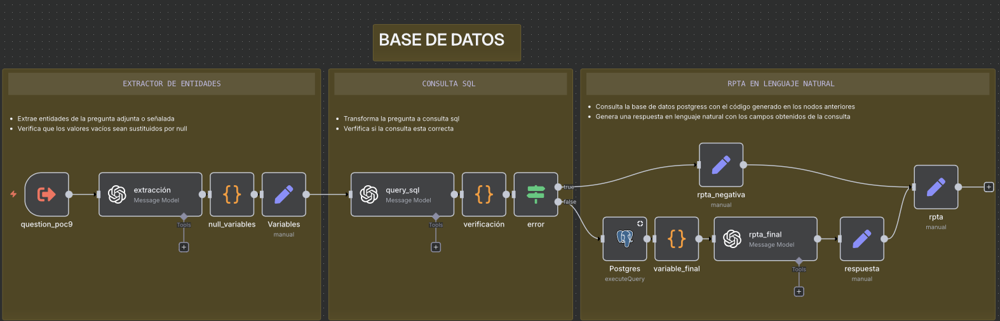
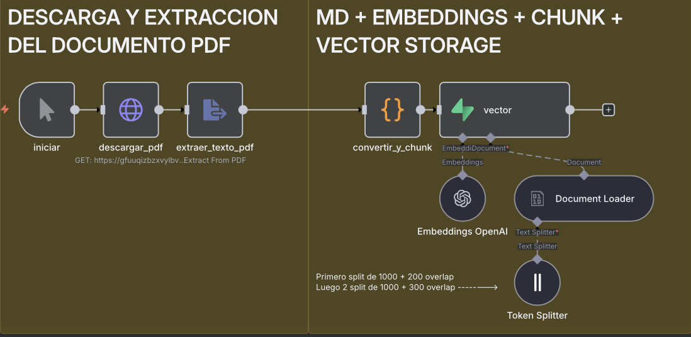
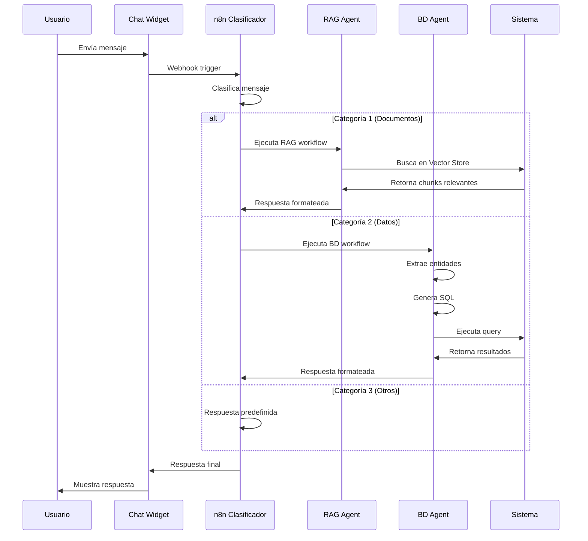

# 🤖 FACTURITO - Sistema Multiagente Inteligente para PRIMA AFP

## 📋 Descripción General

FACTURITO es un asistente virtual inteligente desarrollado como Prueba de Concepto (POC) para **PRIMA AFP**, diseñado para automatizar consultas sobre guías operativas de proveedores e información de facturas. El sistema utiliza una arquitectura multiagente basada en **n8n** que combina RAG (Retrieval-Augmented Generation), consultas SQL y procesamiento de lenguaje natural.

## 🏗️ Arquitectura del Sistema

### Componentes Principales


### 1. **Frontend (index.html)**
- Interfaz web moderna con chat embebido
- Integración con n8n Chat SDK
- Diseño responsive con gradientes púrpura/rosa
- Chat widget flotante con animaciones
  
  [Ir a web](....),  [Ir al codigo json para n8n](https://github.com/Ferx096/poc9_facturito/blob/main/index.html)

  
  
### 2. **Sistema de Clasificación (poc9.json)**
Flujo principal que clasifica las consultas en tres categorías:

#### Agente Clasificador
- **Categoría 1 (PDF/RAG)**: Consultas sobre procesos, documentación, requisitos
- **Categoría 2 (Base de Datos)**: Transacciones, montos, proveedores específicos
- **Categoría 3 (Fuera de alcance)**: Temas no relacionados, saludos, despedidas

  [Ir al codigo json para n8n](https://github.com/Ferx096/poc9_facturito/tree/main/n8n_json/poc9.json)
  

### 3. **Agente RAG (agent_rag.json)**
Maneja consultas sobre la Guía Operativa de Proveedores:

#### Características:
- **Vector Store**: Supabase con embeddings OpenAI (1536 dimensiones)
- **Modelo LLM**: GPT-4.1-mini
- **Top-K**: 8 documentos más relevantes
- **Contenido**: Procedimientos, requisitos, plazos, contactos

#### Información que maneja:
- Proceso de compras (12 etapas)
- Documentación requerida (CNA, SST, PLAFT, etc.)
- Plazos de pago (15 días micro/pequeñas, 30 días resto)
- Contactos por área

[Ir al codigo json para n8n](https://github.com/Ferx096/poc9_facturito/tree/main/n8n_json/agent_rag.json)



### 4. **Agente Base de Datos (agent_bd.json)**
Consulta información transaccional en PostgreSQL:

#### Pipeline de Procesamiento:
1. **Extracción de Entidades**: Identifica parámetros de la consulta
2. **Generación SQL**: Convierte lenguaje natural a SQL optimizado
3. **Ejecución**: Consulta PostgreSQL
4. **Formateo**: Respuesta en lenguaje natural

#### Esquema de Base de Datos:
```sql
CREATE TABLE public.bd (
    "Linea" text,
    "Categoría" text,
    "RUC" text,
    "Proveedor" text,
    "FechaEmisión" date,
    "FechaRecepción" date,
    "FechaRegistro" date,
    "FechaAprobación" date,
    "FechaPago" date,
    "Documento" text,
    "Moneda" text,
    "MontodeEmisión" double precision,
    "Referencia" text,
    "GestordeEnvío" text
);
```

[Ir al codigo json para n8n](https://github.com/Ferx096/poc9_facturito/tree/main/n8n_json/agent_bd.json)



### 5. **Sistema de Embeddings (embeddings.json)**
Preprocesamiento de documentos PDF:

#### Flujo:
1. Descarga PDF desde Supabase Storage
2. Extracción de texto
3. Chunking (800 caracteres con 200 de overlap)
4. Generación de embeddings con OpenAI
5. Almacenamiento en vector store

[Ir al codigo json para n8n](https://github.com/Ferx096/poc9_facturito/tree/main/n8n_json/embeddings.json)



## 🛠️ Tecnologías Utilizadas

| Tecnología | Uso |
|------------|-----|
| **n8n** | Orquestación de workflows |
| **OpenAI GPT-4.1-mini** | Clasificación y extracción |
| **OpenAI GPT-4o** | Respuestas finales BD |
| **OpenAI GPT-5.1** | Generación de SQL |
| **OpenAI - text embedding small 3** | Vectorización de documentos |
| **Supabase** | Vector Store + PostgreSQL |
| **PostgreSQL** | Base de datos de transacciones |


## 📊 Flujos de Trabajo

### Flujo Principal de Conversación:


## 🚀 Instalación y Despliegue

### 1. Clonar el repositorio:
```bash
git clone https://github.com/yourusername/poc9_facturito.git
cd poc9_facturito
```

### 2. Importar flujos en n8n:
1. Acceder a tu instancia n8n
2. Importar cada archivo JSON:
   - `poc9.json` (flujo principal)
   - `agent_rag.json`
   - `agent_bd.json`
   - `embeddings.json`

### 3. Configurar credenciales en n8n:
- OpenAI API (nombre: `openai_poc10`)
- Supabase (nombre: `supabase_poc10`)
- PostgreSQL (nombre: `Postgres_poc10`)

### 4. Preparar la base de datos:
```bash
# Ejecutar script de creación de tabla
psql -h your_host -U your_user -d your_database -f create_table.sql

# Cargar datos iniciales
psql -h your_host -U your_user -d your_database -f seed_data.sql
```

### 5. Procesar documentos (primera vez):
1. Subir PDF a Supabase Storage
2. Ejecutar flujo `embeddings.json` manualmente
3. Verificar creación de embeddings en vector store

### 6. Desplegar frontend:
```bash
# Servir localmente
python -m http.server 8000

# O usar cualquier servidor web estático
```


## 🔍 Características Técnicas Destacadas

### Optimizaciones Implementadas:

1. **Chunking Inteligente**:
   - Tamaño óptimo: 800 caracteres
   - Overlap: 200 caracteres
   - Preservación de contexto en cortes

2. **Normalización de Datos**:
   - Diccionario de sinónimos para proveedores
   - Mapeo automático de fechas
   - Conversión de monedas

3. **SQL Dinámico**:
   - Generación con COUNT(*) OVER() para totales
   - Manejo de columnas con mayúsculas y caracteres especiales
   - Optimización de queries con índices

4. **Manejo de Contexto**:
   - 8 documentos top-K para RAG
   - Memoria de conversación en sesión
   - Respuestas contextualizadas


## 📝 Licencia

Este proyecto está licenciado bajo MIT License - ver el archivo [LICENSE](LICENSE) para más detalles.

## 👥 **Autor**

**Fernando Cabrera** - AI Engineer [linkedin](https://www.linkedin.com/in/fernando-cabrera-barranzuela)

---

⭐ Si este proyecto te ha sido útil, considera darle una estrella en GitHub!

---
