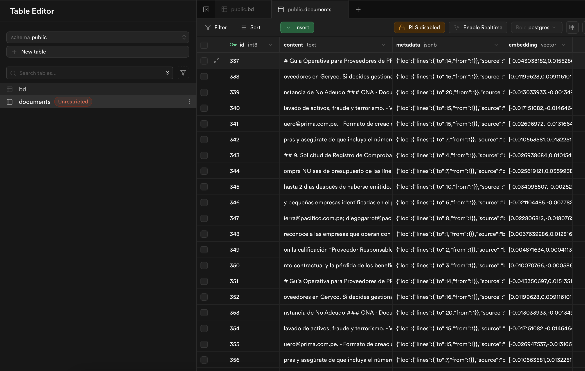
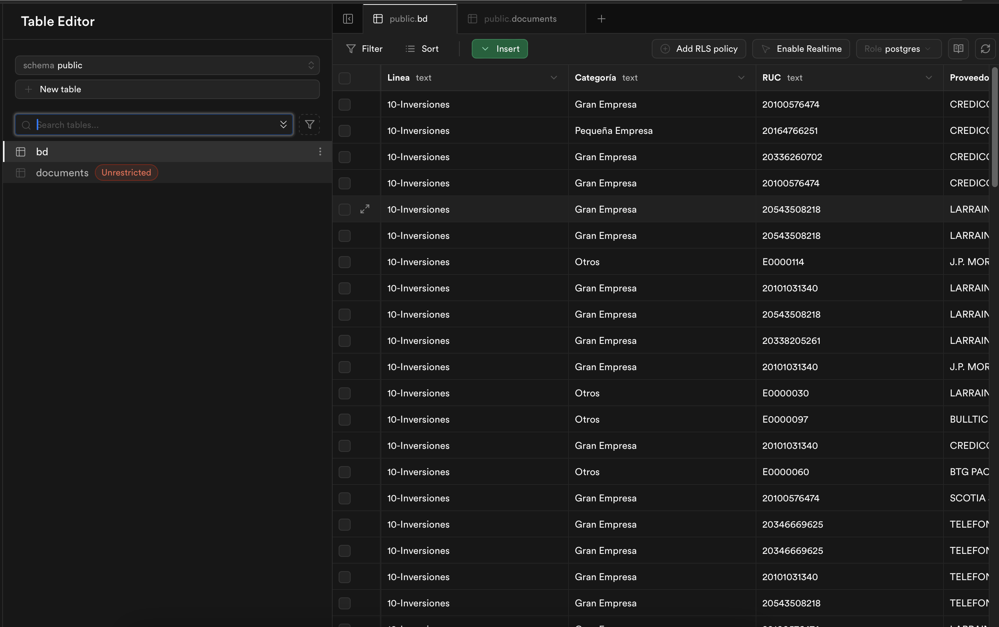

# 📊 Configuración de Supabase para FACTURITO

## 🎯 Descripción General

Este documento detalla el proceso de configuración de Supabase para el sistema FACTURITO. Se utilizan dos componentes principales:

1. **Tabla de Embeddings (documents)** - Para el agente RAG con búsqueda vectorial
2. **Tabla de Datos Transaccionales (bd)** - Para consultas SQL del agente de base de datos

## 🔧 Prerequisitos

### Extensiones Requeridas

1. Antes de crear las tablas, es necesario habilitar las siguientes extensiones en Supabase:
```sql
-- Extensión para búsqueda vectorial (embeddings)
CREATE EXTENSION IF NOT EXISTS vector;

-- Extensión para búsqueda de texto con trigramas
CREATE EXTENSION IF NOT EXISTS pg_trgm;
```
2. 🔒 Configuración de Storage

Para almacenar el PDF de la guía operativa:

    1. Crear bucket `poc10` en Storage
    2. Configurar como público (para POC)
    3. Subir archivo: `guia-proveedores-prima-afp.pdf`
    4. Utilizar el link en el flujo de agente rag para generar los embeddings

## 📋 Estructura de Tablas

### 1. Tabla Documents (RAG - Vector Store)

Esta tabla almacena los embeddings de la documentación procesada para búsquedas semánticas. Juntar los 2 codigo al mmomento de pasarlo por SQL editor

#### Creación de la Tabla
```sql
-- Create a table to store your documents
create table documents (
  id bigserial primary key,
  content text, -- corresponds to Document.pageContent
  metadata jsonb, -- corresponds to Document.metadata
  embedding vector(1536) -- 1536 works for OpenAI embeddings, change if needed
);
```

#### Función de Búsqueda Vectorial
```sql
-- Create a function to search for documents
create function match_search_documents (
  query_embedding vector(1536),
  match_count int default null,
  filter jsonb DEFAULT '{}'
) returns table (
  id bigint,
  content text,
  metadata jsonb,
  similarity float
)
language plpgsql
as $$
#variable_conflict use_column
begin
  return query
select
    id,
    content,
    metadata,
1 - (documents.embedding <=> query_embedding) as similarity
from documents
where metadata @> filter
order by documents.embedding <=> query_embedding
limit match_count;
end;
$$;
```

 
*Estructura de la tabla documents con embeddings vectoriales*


### 2. Tabla BD (Base de Datos Transaccional)

Esta tabla almacena información de proveedores, facturas y transacciones para consultas SQL directas.

#### Estructura de la Tabla

La tabla `bd` contiene los siguientes campos:
- **Linea**: Línea de negocio o presupuestal
- **Categoría**: Categoría del documento
- **RUC**: Registro Único de Contribuyentes
- **Proveedor**: Nombre del proveedor
- **Fechas**: Emisión, Recepción, Registro, Aprobación, Pago
- **Documento**: Tipo o número de documento
- **Moneda**: Tipo de moneda (USD, PEN, EUR)
- **MontodeEmisión**: Monto en la moneda especificada
- **Referencia**: Referencia adicional
- **GestordeEnvío**: Responsable del envío



### Función de Búsqueda con Filtros (match_documents)

Esta función permite búsquedas vectoriales con filtros adicionales basados en metadata:
```sql
create or replace function public.match_documents(
  filter jsonb,
  match_count int,
  query_embedding vector(1536)
)
returns table (
  id uuid,
  content text,
  metadata jsonb,
  similarity float
)
language plpgsql
as $$
begin
  return query
select
    id,
    content,
    metadata,
1 - (embedding <=> query_embedding) as similarity
from
    documents
where
(filter is null or metadata @> filter)
order by
    embedding <=> query_embedding
limit match_count;
end;
$$;
```

## 🚀 Pasos de Configuración

### 1. Acceder a Supabase SQL Editor
1. Ingresar a tu proyecto en [Supabase Dashboard](https://app.supabase.com)
2. Navegar a **SQL Editor** en el menú lateral
3. Crear un nuevo query

### 2. Ejecutar Scripts en Orden
1. **Primero**: Habilitar extensiones
2. **Segundo**: Crear tabla `documents`
3. **Tercero**: Crear funciones de búsqueda
4. **Cuarto**: Crear tabla `bd` (si no existe)

### 3. Verificar Creación
- Ir a **Table Editor** para verificar las tablas
- Probar las funciones en **SQL Editor**

## 📝 Notas Importantes

### Dimensiones de Embeddings
- El sistema está configurado para embeddings de **1536 dimensiones** (OpenAI)
- Si usas otro proveedor, ajusta el tamaño del vector en las definiciones

---

📚 **Documentación adicional**: [Supabase Vector Docs](https://supabase.com/docs/guides/ai/vector-columns)
